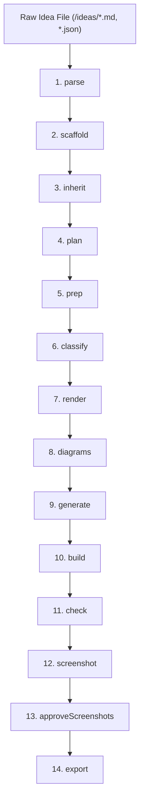

# Ideas-to-Book Automation (v3.0 Specification)

## 1. Executive Vision & Architecture

The paper-engine automation system operates on two integrated tiers under an **Agent-Native Execution Model**:

1. **Micro-Engine — `block` Skill (`.agents/skills/block/`)**:
   - Manages the authoring and formatting of **one single B5 page** (`<section class="sheet bb">`).
   - Applies strict layout laws: 1 concept per page, 3 paragraphs (opener/pain, mechanism/outcome, closer), color roles (`.bad` threat/pain, `.hl` mechanism, `.good` outcome), action callout (`.ask`), inline SVG diagram (`diagram-system.md`) or photorealistic image (`photo-blocks.md`), and **0 mm overflow**.

2. **Macro-Orchestrator — `ideas-to-book` (`engine/tools/ideas-to-book.mjs`)**:
   - Manages the multi-page book project from raw idea file (`ideas/*.md` or `.json`) to finished PDF (`books/<slug>/<slug>.pdf`).
   - Scaffolds book folders, parses manifest data, orchestrates the `block` skill workflow across all pages, assembles interior HTML, generates book chrome (cover, colophon, TOC, part dividers, running headers, index via `build-book.mjs`), verifies 0 mm overflow (`check.mjs`), captures visual screenshots (`shot.mjs`), and exports print-ready PDFs (`export.mjs`).

### Agent-Native Principle
The system runs directly inside an active AI coding assistant (AGY, Claude Code, OpenCode, Gemini, etc.). It **does not require external API keys** or standalone provider scanners. For page preparation and SVG diagram generation, the toolchain outputs structured prompt files (`.work/page-XXX-prompt.json` / `.work/diagram-XXX-prompt.json`) for the active agent to process.

---

## 2. Prerequisites & Core Engine Tools

Before running the automation, ensure:
- Paper engine dependencies are installed (`npm install`).
- Playwright browser binary is installed (`npx playwright install chromium`).
- An idea file exists in `/ideas/` (`.md` or `.json`).
- Template book exists (default: `books/STEAM-IE-FOR-HYDROPONICS`).

The existing engine tools remain the foundation:
```text
engine/tools/build-book.mjs   # Book chrome assembly
engine/tools/check.mjs        # Playwright 0mm overflow checker
engine/tools/shot.mjs         # Page screenshot generator
engine/tools/export.mjs       # Print PDF exporter
engine/tools/gen-image.mjs    # Photo generation wrapper
```

---

## 3. The 14-Stage Automation Pipeline

The orchestrator enforces a 14-stage state machine with interactive approval gates:



| # | Stage | Script | Description | Output |
|---|---|---|---|---|
| 1 | `parse` | `idea-parser.mjs` | Extracts metadata, titles, subtitles, section assignments (S, T, E, A, M, I, IE), action callouts, image prompts, and citations. | `.work/idea-manifest.json` |
| 2 | `scaffold` | `book-scaffold.mjs` | Copies template, renames interior file to `<slug>.html`, updates `book.json`, and safely preserves cover references via `chooseCoverImage()`. | `books/<slug>/` folder |
| 3 | `inherit` | `inherited-pages.mjs` | Customizes front/back matter (cover, colophon, TOC, how-to-read, index, back cover). | Custom front/back matter |
| 4 | `plan` | `ideas-to-book.mjs` | Displays page plan for review and configures citation style (`preserve`, `footnotes`, `references`, `remove`). | Citation configuration |
| 5 | `prep` | `prep-pages.mjs` | Opt-in content prep trimming text to ~65 words (max 85 words) using `block` skill rules and logging `prepHistory`. | `page.preparedContent`, `prepHistory` |
| 6 | `classify` | `image-classifier.mjs` | Classifies images as `photo` (physical objects -> PNG) or `diagram` (mechanisms -> inline SVG). | Classification array |
| 7 | `render` | `book-render.mjs` | Generates `<slug>.html` interior HTML using sanitized DOMPurify/JSDOM output, color tabs, and footnotes/references pages. | `books/<slug>/<slug>.html` |
| 8 | `diagrams` | `ideas-to-book.mjs` | Synthesizes inline SVG diagrams using `diagram-system.md` shapes and re-renders interior HTML. | `images/*.svg` |
| 9 | `generate` | `book-assets.mjs` | Generates photo assets via `gen-image.mjs` or uses placeholders; creates asset report. | `.work/asset-report.json` |
| 10 | `build` | `build-book.mjs` | Assembles interior pages into `book.html` with running headers, page numbers, part dividers, TOC, and index. | `books/<slug>/book.html` |
| 11 | `check` | `check.mjs` | Playwright layout checker verifying 0 mm overflow across all pages. | Machine-readable overflow report |
| 12 | `screenshot` | `shot.mjs` | Captures high-res Playwright PNG screenshots for visual inspection. | `books/<slug>/page*.png` |
| 13 | `approveScreenshots` | `ideas-to-book.mjs` | Human visual review gate for all screenshot PNGs. | Approval entry in `.work/approval.json` |
| 14 | `export` | `export.mjs` | Converts `book.html` into a print-ready B5 PDF. | `books/<slug>/<slug>.pdf` |

---

## 4. Approval State & Resumption (`approval.json`)

The orchestrator tracks progress in `books/<slug>/.work/approval.json`:

```json
{
  "slug": "solar-dryer-fruit-processing",
  "source": "ideas/Solar-Dryer-Fabrication-Fruit-Processing.md",
  "stages": {
    "parsed": true,
    "scaffolded": true,
    "inheritedEdited": true,
    "planned": true,
    "pagesPrepared": true,
    "assetsClassified": true,
    "pagesRendered": true,
    "diagramsGenerated": true,
    "assetsGenerated": true,
    "buildPassed": true,
    "checksPassed": true,
    "screenshotsApproved": true,
    "pdfExported": true
  },
  "approvals": [
    {
      "stage": "parsed",
      "approvedBy": "human",
      "at": "2026-10-08T16:00:00.000Z"
    }
  ]
}
```

The exported `firstUnapprovedStage(bookDir)` function maps `APPROVAL_STATE` keys back to CLI stage names, allowing `--resume` to resume seamlessly from the exact unapproved stage.

---

## 5. Command-Line Interface Specification

```bash
# List available idea files
node engine/tools/ideas-to-book.mjs --list-ideas

# Interactive selection
node engine/tools/ideas-to-book.mjs --select

# Run specific idea file with defaults
node engine/tools/ideas-to-book.mjs ideas/Solar-Dryer-Fabrication-Fruit-Processing.md

# Specify template, slug, and enable content prep
node engine/tools/ideas-to-book.mjs ideas/my-idea.md --template books/STEAM-IE-FOR-HYDROPONICS --slug my-book --prep-page

# Single stage execution
node engine/tools/ideas-to-book.mjs books/my-book --stage render

# Resume interrupted run
node engine/tools/ideas-to-book.mjs ideas/my-idea.md --resume

# Force re-run from scratch
node engine/tools/ideas-to-book.mjs ideas/my-idea.md --force
```

---

## 6. Testing & Quality Assurance

Automated tests are executed via Node's native test runner (`npm test`):

```bash
npm test  # Runs node --test test/*.test.mjs
```

Test coverage includes:
- `test/shared.test.mjs`: Slug normalization, word counting, HTML escaping.
- `test/idea-parser.test.mjs`: Front-matter parsing and manifest structure.
- `test/image-classifier.test.mjs`: Photo vs diagram keyword heuristics.
- `test/page-validator.test.mjs`: Page rule validation and word count bounds.
- `test/prep-authoring.test.mjs`: Editor round-trip parsing and prompt file generation.
- `test/check-json.test.mjs`: Machine-readable overflow checking.
- `test/round2.test.mjs`: Resumption logic and cover image selection.
